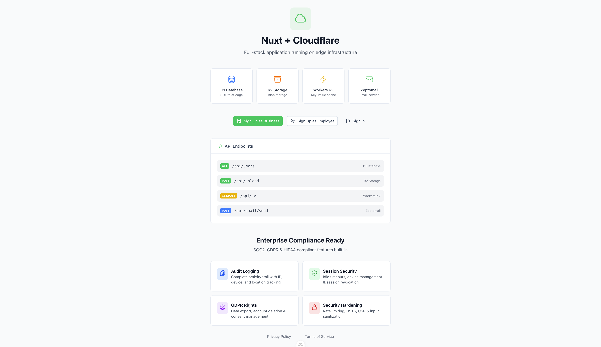
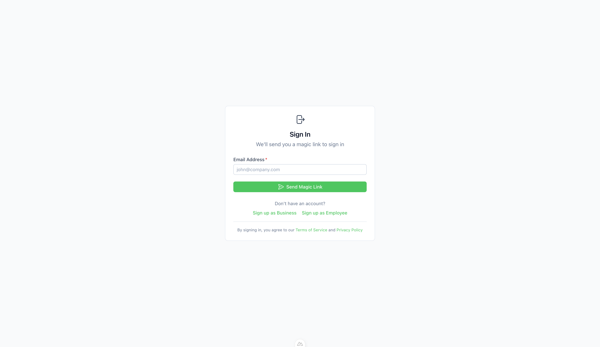

# Nuxt 4 SaaS Starter

[](https://nuxt.com)
[](https://ui.nuxt.com)
[](https://hub.nuxt.com)
[](https://orm.drizzle.team)

<br>

<p align="center">
  
  
</p>

A structured, production-ready SaaS boilerplate built with **Nuxt 4**, **NuxtHub**, and **Nuxt UI v4**. Designed for speed, scalability, and ease of deployment to Cloudflare.

## ✨ Features

- **Full-Stack Power**: Built on [Nuxt 4](https://nuxt.com) with a server-first approach.
- **Database**: [SQLite (D1)](https://developers.cloudflare.com/d1/) managed via [Drizzle ORM](https://orm.drizzle.team) for type-safe database interactions.
- **Authentication**: Secure, session-based authentication using [Nuxt Auth Utils](https://github.com/atinux/nuxt-auth-utils).
- **UI Framework**: Beautiful, accessible components with [Nuxt UI v4](https://ui.nuxt.com) (Tailwind CSS under the hood).
- **Serverless Ready**: Pre-configured with [NuxtHub](https://hub.nuxt.com) for Cloudflare Workers (Blob Storage, KV, Database, Cache).
- **Real-time Chat**: End-to-end encrypted messaging with WebSocket support.
- **Email**: Transactional email support configured for **ZeptoMail**.
- **Testing**: Unit and integration testing setup with **Vitest**.
- **Type Safety**: End-to-end TypeScript support.

## ⚡ Detailed Features

### 🔐 Authentication & Security
- **Magic Link Auth**: Passwordless login via email magic links.
- **Rate Limiting**: Built-in rate limiting for sensitive endpoints (Login, Signup, Data Export).
- **Audit Logging**: Comprehensive audit trails for security-critical actions (Signups, Profile Updates).
- **Role-Based Access**: Dedicated signup flows for **Business** and **Employee** roles.
- **Session Management**: Secure session handling with device tracking and revocation.

### 💬 Real-time Messaging
- **End-to-End Encryption**: All messages are encrypted client-side using RSA-OAEP key exchange and AES-GCM encryption.
- **WebSocket Communication**: Real-time message delivery via WebSocket connections.
- **Read Receipts**: Instant read status updates across all participants.
- **Online Presence**: Real-time online/offline status indicators.
- **Unread Counts**: Per-conversation unread message counts.
- **Notification Sounds**: Audio alerts for new messages.

### 🛡 User Privacy & GDPR
- **Data Export**: Full "Right to Access" (DSAR) support with JSON data export.
- **Account Deletion**: "Right to Erasure" with soft-delete and scheduled hard-delete.
- **Consent Management**: Granular consent preferences for marketing and analytics.
- **Activity Logs**: User-accessible security event history.
- **Profile Management**: Secure profile updates with strict input sanitization.

### 🏗 Backend & Infrastructure
- **D1 Database**: Serverless SQLite database with Drizzle ORM.
- **NuxtHub Integration**: Native support for Cloudflare KV, Blob Storage, and Cache.
- **Input Validation**: Robust validation using Zod and custom sanitizers.

## 🛠 Tech Stack

- **Framework**: [Nuxt 4](https://nuxt.com)
- **Language**: TypeScript
- **Database**: SQLite (Cloudflare D1) via Drizzle ORM
- **Styling**: Tailwind CSS (via Nuxt UI)
- **Deployment**: Cloudflare Pages / Workers
- **Package Manager**: Bun (recommended) or npm/pnpm


## 🚀 Getting Started

### Prerequisites

- [Node.js](https://nodejs.org/) (v18 or later)
- [Bun](https://bun.sh/) (recommended) or npm/pnpm

### Installation

**Option 1: CLI (Recommended)**
Scaffold a new project in seconds:

```bash
npx create-nuxt4-saas-starter my-saas-app
```

**Option 2: Manual Clone**

1.  **Clone the repository:**

    ```bash
    git clone https://github.com/bootssecurity/nuxt4-saas-starter.git
    cd nuxt-app
    ```

2.  **Install dependencies:**

    ```bash
    bun install
    # or
    npm install
    ```

3.  **Setup Environment Variables:**

    Copy the example `.env` file and update it with your credentials.

    ```bash
    cp .env.example .env
    ```

    Update the `.env` file with your specific configuration (e.g., `ZEPTOMAIL_API_KEY`, `NUXT_SESSION_PASSWORD`).

### Development

Start the development server:

```bash
bun dev
# or
npm run dev
```

Visit `http://localhost:3000` to see your app running.

### 🔍 Production Preview

To test the production build locally (simulating Cloudflare Pages environment):

```bash
bun run build
npx wrangler pages dev dist
```

This ensures your app works exactly as it will on Cloudflare (including `_worker.js` and bindings).

## 🗄 Database

This project uses **Drizzle ORM** with **SQLite**.

### Standard Commands

-   **Generate Migrations**: Create SQL migrations based on your schema changes.

    ```bash
    bun db:generate
    ```

-   **Migrate Database**: Apply migrations to your local or remote database (managed via NuxtHub in dev).

    *Note: In development with NuxtHub, migrations are often handled automatically or via the NuxtHub admin interface.*

## 📦 Deployment

This project is configured for **automated deployment** to [Cloudflare Pages](https://pages.cloudflare.com/) using GitHub Actions.

👉 **[Read the Full Deployment Guide](./docs/deployment.md)** for step-by-step setup instructions.

### Quick Summary
- **Infrastructure**: Cloudflare Pages + Workers (D1, KV, R2).
- **Automation**: Pushing to the `main` branch automatically builds and deploys.
- **Secrets**: Managed securely via Cloudflare Dashboard (not in git).

### Manual Deployment
You can also deploy manually if needed:
```bash
bun run deploy
```

## 🧪 Testing

Run the test suite using Vitest:

```bash
# Run all tests
bun test

# Run in watch mode
bun run test:watch

# Run with coverage
bun run test:coverage
```

## 📂 Project Structure

-   `app/`: Frontend Vue components, pages, and layouts.
-   `server/`: Backend API routes, database schema, and server utilities.
    -   `server/database/schema.ts`: Drizzle ORM schema definitions.
    -   `server/api/`: API endpoints.
-   `public/`: Static assets.
-   `nuxt.config.ts`: Nuxt configuration.

## 📚 Documentation

For detailed API documentation, please check the [Wiki / API Docs](./docs/api/README.md).

## 📄 License

MIT License.
